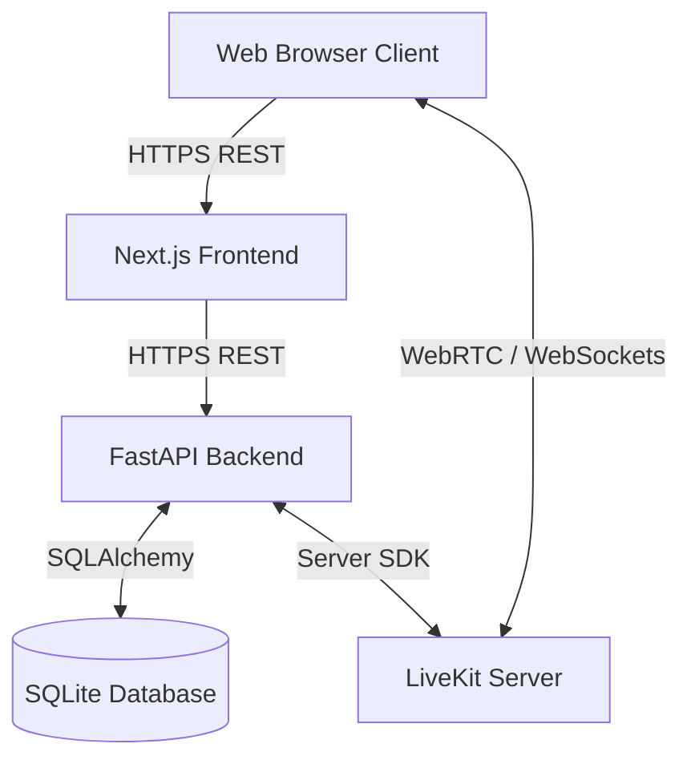
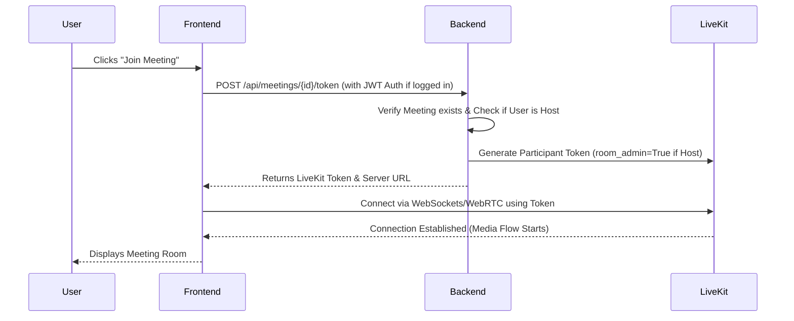

# Zoom Clone - Video Conferencing Platform

A full-stack video conferencing application built to closely replicate the core functionalities, design, and user experience of Zoom. This project goes beyond a simple UI clone by implementing a production-ready WebRTC architecture for real-time communication, a robust authentication system, and a persistent database for scheduling and meeting management.

The platform is designed to allow users to instantly create, schedule, and join video meetings. It solves the complex engineering challenge of managing real-time media streams and user signaling by leveraging LiveKit's SFU (Selective Forwarding Unit) infrastructure, combined with a FastAPI backend and a Next.js App Router frontend.

## 🔗 Live Demo and Links

- **Live Application**: [https://zoom-clone-tau-pearl.vercel.app](https://zoom-clone-tau-pearl.vercel.app)
- **Frontend Hosting**: Vercel
- **Backend Hosting**: Railway

*(Note: Since this is hosted on free tiers, the backend may take 30-60 seconds to spin up from sleep upon first request.)*

## ✨ Feature Breakdown

### 🔐 Authentication & Registration
- **Email Registration & Verification**: Users can sign up for an account. The system sends a secure SMTP email with a verification token.
- **Password Reset**: Includes a fully functional "Forgot Password" flow utilizing secure expiring tokens and SMTP email delivery.
- **JWT Authentication**: Secure stateless session management using HTTP headers and `localStorage`.

### 📅 Meeting Management
- **Instant Meetings**: One-click generation of active meeting rooms with unique 11-digit IDs and shareable invitation links.
- **Schedule Meetings**: Users can schedule upcoming meetings with titles, descriptions, dates, times, and durations.
- **Dashboard Synchronization**: Upcoming and recent meetings are dynamically fetched and displayed on the user's dashboard.
- **Meeting Deletion & Editing**: Hosts can delete or rename their scheduled meetings directly from the dashboard interface.

### 🎥 Video Conferencing (WebRTC)
- **Pre-join Lobby**: Users can configure their camera and microphone, and set their display name before entering the room.
- **Real-time Media**: Low-latency audio and video streaming using LiveKit.
- **Participant Management**: The room dynamically scales to show all active participants.
- **Host Controls**: Authenticated hosts have elevated privileges to mute individuals, mute all, disable cameras, kick participants, or end the meeting for everyone. (These commands are broadcasted via LiveKit's DataChannel).
- **Guest Access**: Users without an account can join meetings via a link by simply providing a display name.

### 📱 UI & Experience
- **Responsive Design**: Fluid layouts that adapt beautifully to mobile phones, tablets, and desktop displays (including a highly responsive mobile meeting card layout).
- **Modern Aesthetics**: Built with Tailwind CSS, utilizing clean modals, glassmorphism, and intuitive Zoom-style iconography.

*(Note: Features like Recordings, Summaries, Chat, and My Notes are currently represented in the UI as upcoming/planned features and are not fully implemented.)*

## 🛠 Technology Stack

| Technology | Where it is used | Purpose | Why it was chosen |
|------------|------------------|---------|-------------------|
| **Next.js 15 (App Router)** | Frontend | React framework for UI | Provides excellent routing, performance, and server-component architecture. |
| **Tailwind CSS** | Frontend | Styling | Enables rapid, utility-first responsive UI development without massive CSS files. |
| **Zustand** | Frontend | State Management | Lightweight and boilerplate-free global state management (used for User/Auth state). |
| **LiveKit Components** | Frontend/Backend | WebRTC / SFU | Abstracting complex WebRTC peer-connection logic into a scalable SFU architecture. |
| **FastAPI (Python)** | Backend | REST API | Extremely fast, asynchronous Python framework with built-in data validation (Pydantic). |
| **SQLite / SQLAlchemy** | Backend | Database & ORM | Reliable persistence for users and meetings. |
| **PyJWT & Passlib** | Backend | Security | Secure password hashing and token generation. |
| **smtplib (Python)** | Backend | Email Delivery | Handling asynchronous SMTP dispatch for verification/reset emails. |

## 📐 System Architecture

### Component Interaction
1. **Frontend (Vercel)** handles the UI and routing. It communicates with the **Backend API** via standard HTTP/REST for CRUD operations (creating meetings, logging in).
2. **Backend (Railway)** processes business logic, interacts with the **SQLite Database**, and securely communicates with the **LiveKit Cloud API** to generate access tokens.
3. **Clients (Browsers)** receive the generated LiveKit JWT token from the backend and connect directly to the **LiveKit SFU Server** via WebSockets and WebRTC for real-time signaling and media transfer, bypassing the Python backend for heavy video traffic.

### Architecture Diagram



### Meeting Workflow Sequence



## 🔐 Assumptions, Permissions, and Product Decisions

During the development of this platform, several intentional product and engineering decisions were made:

- **Guest vs. Authenticated User**: 
  - **Guests** can join any meeting if they have the link and a display name. However, they cannot schedule new meetings, access the dashboard, or possess Host controls.
  - **Authenticated Users** have persistent accounts, a dashboard of upcoming meetings, and become the designated "Host" of any meeting they create.
- **Host Privileges Enforcement**: When an authenticated user joins a meeting they created, the FastAPI backend flags `is_host=True` inside the secure LiveKit JWT token. This grants them `room_admin` capabilities in the LiveKit room, allowing them to issue secure DataChannel commands (Mute All, Kick, End Meeting) that guest clients are programmed to obey.
- **Database Ephemerality (Railway Free Tier)**: The backend is currently hosted on Railway's free tier using a local SQLite file. Deployments on Railway without a persistent volume attached will reset the SQLite database on every server restart or redeployment. This is an infrastructure limitation, not a software bug.
- **Silent Failures on Password Reset**: For security purposes (to prevent user enumeration attacks), the "Forgot Password" endpoint will return a success message even if the requested email does not exist in the database.

## 📂 Project Structure

```text
zoom-clone/
├── backend/                  # FastAPI Application
│   ├── app/
│   │   ├── models/           # SQLAlchemy DB Models (user, meeting, participant)
│   │   ├── repositories/     # Database access layer
│   │   ├── routers/          # API Endpoints (auth, meetings)
│   │   ├── schemas/          # Pydantic validation schemas
│   │   ├── services/         # Business logic (email, livekit, meetings)
│   │   ├── database.py       # DB connection config
│   │   └── main.py           # Application entry point & auto-migrations
│   ├── requirements.txt      
│   └── render.yaml           # Deployment configuration
│
└── frontend/                 # Next.js Application
    ├── app/                  # App Router pages (auth, dashboard, meeting, schedule)
    ├── components/           
    │   ├── auth/             # Login/Signup UI
    │   ├── dashboard/        # Dashboard layout & Meeting Cards
    │   ├── meeting/          # Video room, Toolbar, Participants Panel
    │   └── shell/            # Global layout wrapper (Navbar, Sidebar)
    ├── lib/                  # API wrappers & utilities
    └── stores/               # Zustand state stores
```

## 🚀 Installation and Local Setup

### Prerequisites
- Node.js (v18+)
- Python (3.9+)
- A [LiveKit Cloud](https://cloud.livekit.io/) account (Free)
- A Gmail account with an App Password (for SMTP emails)

### 1. Clone the Repository
```bash
git clone https://github.com/KunalGupta28/zoom-clone.git
cd zoom-clone
```

### 2. Backend Setup
```bash
cd backend
python -m venv venv

# Activate virtual environment
# Windows:
.\venv\Scripts\activate
# Mac/Linux:
source venv/bin/activate

pip install -r requirements.txt
```

Create a `.env` file in the `backend` directory (see Environment Variables section below).

Start the FastAPI server:
```bash
fastapi dev app/main.py
```
*The backend will run at `http://localhost:8000`. The SQLite database will auto-generate on first boot.*

### 3. Frontend Setup
Open a new terminal window:
```bash
cd frontend
npm install
```

Create a `.env.local` file in the `frontend` directory.

Start the Next.js development server:
```bash
npm run dev
```
*The frontend will run at `http://localhost:3000`.*

## 🔑 Environment Variables

### Backend (`backend/.env`)
| Variable | Purpose | Required? | Example |
|----------|---------|-----------|---------|
| `DATABASE_URL` | SQLite connection string | Yes | `sqlite:///./zoom_clone.db` |
| `JWT_SECRET_KEY` | Secret for signing Auth tokens | Yes | `super-secret-key-123` |
| `LIVEKIT_URL` | LiveKit WebSocket URL | Yes | `wss://your-project.livekit.cloud` |
| `LIVEKIT_API_KEY` | LiveKit API Key | Yes | `API...` |
| `LIVEKIT_API_SECRET`| LiveKit API Secret | Yes | `...` |
| `FRONTEND_ORIGIN` | CORS configuration | Yes | `http://localhost:3000` |
| `SMTP_EMAIL` | Gmail address for dispatching auth emails | Yes | `your-email@gmail.com` |
| `SMTP_PASSWORD` | Gmail App Password (NOT your normal password) | Yes | `abcd efgh ijkl mnop` |
| `SMTP_HOST` | SMTP server address | Yes | `smtp.gmail.com` |
| `SMTP_PORT` | SMTP port | Yes | `587` |

### Frontend (`frontend/.env.local`)
| Variable | Purpose | Required? | Example |
|----------|---------|-----------|---------|
| `NEXT_PUBLIC_API_URL` | URL of the FastAPI backend | Yes | `http://localhost:8000` |
| `NEXT_PUBLIC_LIVEKIT_URL` | LiveKit WebSocket URL | Yes | `wss://your-project.livekit.cloud` |

> ⚠️ **Warning**: Never commit your `.env` files to version control. Both frontend and backend directories include `.gitignore` files to prevent this.

## 🛡 Authentication, Security, and Error Handling
- **Password Security**: Passwords are never stored in plaintext. They are hashed using `bcrypt` via Passlib before saving to the database.
- **Token Expiration**: JWT tokens for user sessions expire automatically, requiring re-authentication.
- **Verification Tokens**: Email verification and password reset tokens are uniquely generated, stored in the database, and checked during the respective endpoints.
- **API Error Handling**: The frontend `api.ts` utility gracefully catches `400` and `500` level errors, parsing the backend's `detail` message to display informative toast alerts to the user.

## 🐛 Troubleshooting
- **No Email Received**: If you are testing locally and aren't receiving verification emails, ensure your Gmail account has 2FA enabled and you have generated a specific "App Password" for the `SMTP_PASSWORD` variable. Standard account passwords will be blocked by Google.
- **Camera/Microphone Failures**: Ensure you are accessing the app via `localhost` or a secure `https://` connection. Modern browsers block media device access on insecure HTTP connections.
- **Database Locked (SQLite)**: If you experience "database is locked" errors on Windows, ensure you don't have a database viewer tool (like DB Browser) holding a write lock on `zoom_clone.db`.

## 🚀 Future Improvements (Roadmap)
- [ ] **Persistent Cloud Database**: Migrate from SQLite to PostgreSQL (e.g., Supabase or Neon) to prevent data loss across server redeployments.
- [ ] **Meeting Chat**: Implement a real-time text chat panel using LiveKit DataChannels.
- [ ] **Screen Sharing**: Add standard screen capture capabilities using the `livekit-components-react` library.
- [ ] **Waiting Rooms**: Allow hosts to selectively admit users from a lobby state.
- [ ] **Recording & Summaries**: Integrate AI transcription and cloud recording services.

## 🤝 Contribution Guidelines
This project is open-source and welcomes contributions!
1. Fork the repository.
2. Create a feature branch (`git checkout -b feature/amazing-feature`).
3. Commit your changes (`git commit -m 'Add amazing feature'`).
4. Push to the branch (`git push origin feature/amazing-feature`).
5. Open a Pull Request.

*(Note: This repository currently has no declared license. Please refer to standard copyright laws regarding code reuse until the owner attaches an explicit license.)*
